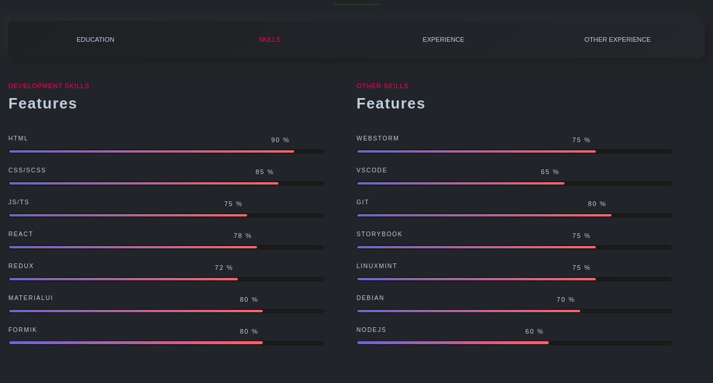

<h1 align="center">My home page</h1>
<h2 align="center">

</h2>

<p align="center">

[//]: # ''


</p>

<h2 align="center"><a  href="https:msaserj.ru">Live Demo</a></h2>

## Description

**My home page site**

<p align="center"></p>
<p align="center">
</p>
<p align="center"></p>

## About the project.

Portfolio project. Inspired by design https://themeforest.net/user/rainbow-themes

## Technologies

**React**,
**TS**,
**SCSS**.

## Project setup

```
npm install
npm run serve
```

#### use yarn

```
yarn
yarn start
```

## Future scope

- Add blog
- Add description modals for my works (done!)

## My Home Page

[Sergei Minko aka msaserj](https://msaserj.ru)
